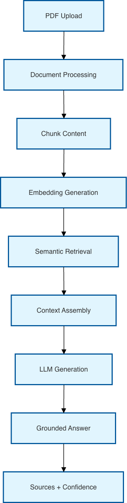
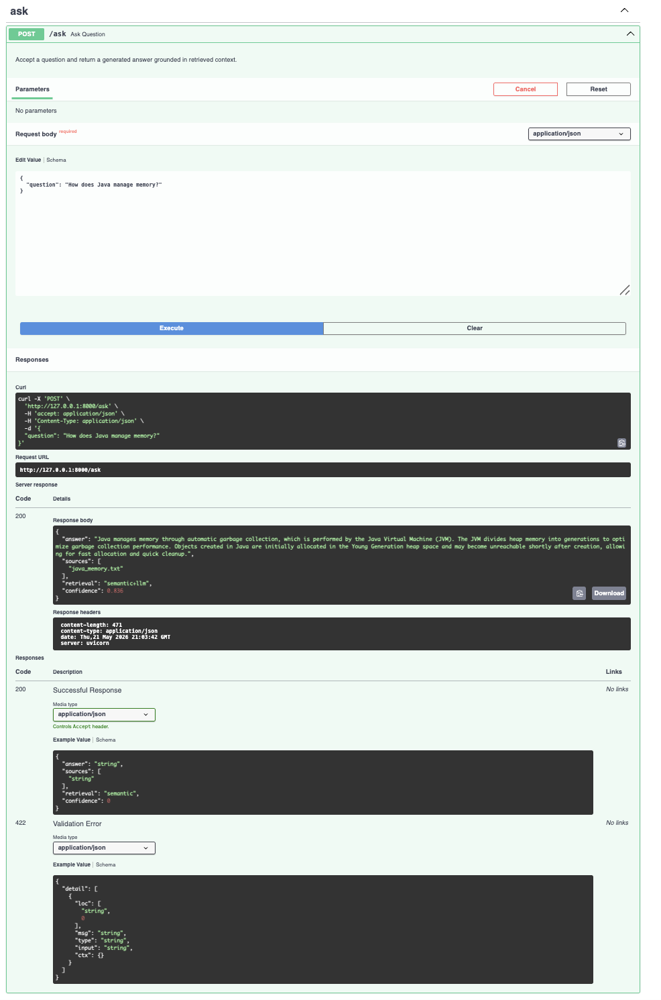

# RAG Observatory

Production-inspired Retrieval Augmented Generation (RAG) system built to explore document ingestion, semantic retrieval, grounded answer generation, and AI engineering workflows.

The platform processes uploaded documents, retrieves relevant context using embeddings and hybrid retrieval strategies, and generates grounded responses using local LLM inference.

## Project Structure

- `backend/`
  - `app/` - Python FastAPI backend package
  - `api/` - HTTP endpoints for health, uploads, and question answering
  - `services/` - document processing, retrieval, embeddings, generation, and citations
  - `models/` - request and response schemas
  - `config/` - application configuration
- `frontend/` - placeholder for future React UI
- `docs/` - architecture and design notes
- `tests/` - automated tests and validation

---

## Features

- PDF document ingestion and preprocessing
- Semantic retrieval using sentence-transformers embeddings
- Hybrid retrieval (semantic + keyword scoring)
- Grounded answer generation using Ollama
- Confidence-based retrieval metadata
- Modular service-oriented architecture
- FastAPI APIs with Swagger documentation

---

## Architecture



---

## Demo

### Semantic Retrieval + Grounded Generation



---

## Retrieval Pipeline

```text
PDF Upload
↓
Extract Text
↓
Process Document
↓
Chunk Content
↓
Generate Embeddings
↓
Semantic Retrieval
↓
Context Assembly
↓
LLM Generation
↓
Grounded Answer
```

## Tech Stack

- Python
- FastAPI
- PyPDF
- sentence-transformers
- scikit-learn
- Ollama
- Swagger/OpenAPI

---

## Getting Started

### 1. Create and activate virtual environment

```bash
python -m venv .venv
source .venv/bin/activate
```

### 2. Install dependencies

```bash
pip install -r backend/requirements.txt
```

### 3. Run backend

```bash
uvicorn backend.app.main:app --reload --host 0.0.0.0 --port 8000
```

### 4. Open Swagger

```text
http://127.0.0.1:8000/docs
```

### 5. Verify health endpoint

```bash
curl http://127.0.0.1:8000/health
```

Expected:

```json
{
  "status": "healthy"
}
```

---

## API Endpoints

### Health

```http
GET /health
```

Service readiness check.

### Upload

```http
POST /upload
```

Upload PDF documents.

### Ask

```http
POST /ask
```

Ask questions and receive grounded answers.

Example:

```json
{
  "question": "How does Java manage memory?"
}
```

Response:

```json
{
  "answer": "Java manages memory using garbage collection...",
  "sources": [
    "java_memory.txt"
  ],
  "retrieval": "semantic+llm",
  "confidence": 0.836
}
```

---

## Notes

- Built with FastAPI and modular service architecture.
- Retrieval combines embeddings and hybrid scoring.
- Local LLM generation uses Ollama for grounded responses.
- Designed for future extensions including citations, evaluation, observability, and deployment.

---

## Current Status

Completed:

- ✅ PDF ingestion
- ✅ Semantic retrieval
- ✅ Hybrid scoring
- ✅ Grounded LLM generation
- ⬜ Citation enforcement
- ⬜ Evaluation metrics
- ⬜ Observability
- ⬜ Deployment
